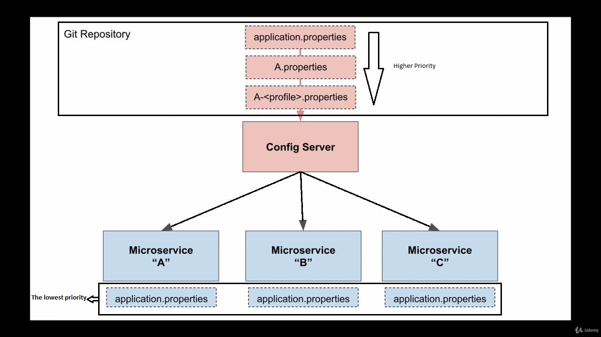

# Configuration-Server

dependencies:
for confserver:"spring-cloud-config-server".
for client: "Spring Cloud Starter Config".

In this project, we set up a configuration server to get properties from it. The properties of this server have higher priority than the local ones, so if we have the same property locally and in the configserver the remote one would be activated.

The ConfigServer will read the application.properties file from Git repository and provide the webservices by them.

After creating git repository we need to upload application.properties in the master branch and provide our configserver some setting like the username/password of our GitHub account, the servername and the port number. All this properties are set in application.properties in the local server.

After that, we should configure the services as a client of ConfigServer by adding bootstrap.properties and add the Uri of the configserver and its name. 
If we want all of our services that registered to eureka to use the remote properties then we have to configure out zuul gateway as a client of ConfigServer also.

<h2>application architecture<h2>

    
